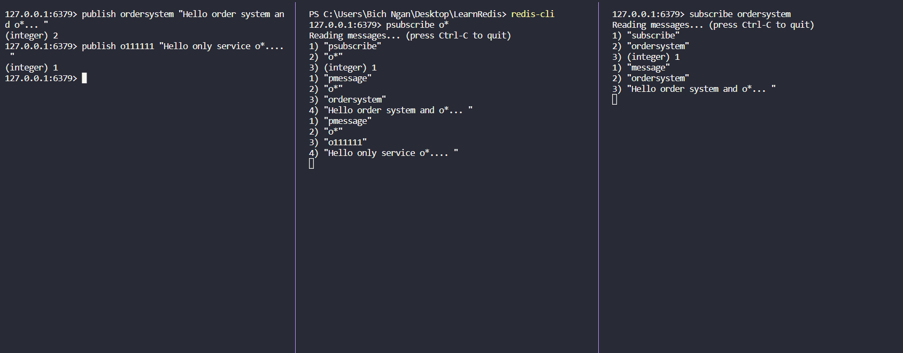
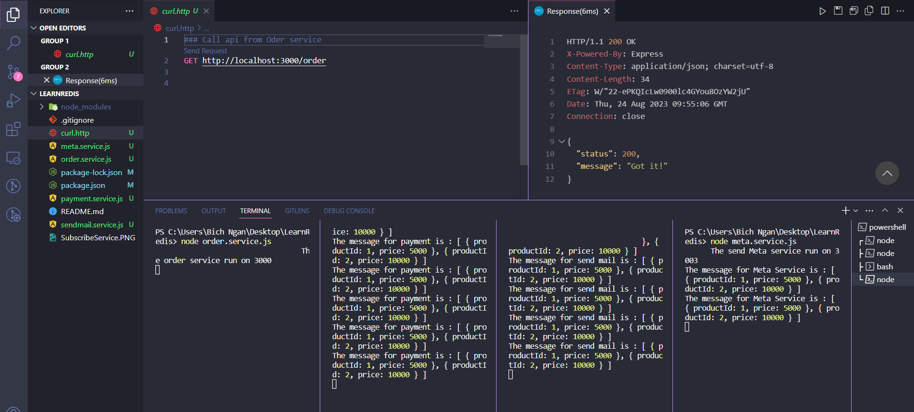

# Learn Redis
- Home Page: https://redis.io/
- Install for Window: https://github.com/microsoftarchive/redis/releases
- Redis Commander: Redis web management tool written in node.js - https://www.npmjs.com/package/redis-commander

## Sự có tuyết lở trong Redis (Sập hệ thống)
- 2 lý do:
    - 1. 1 lượng lớn dữ liệu hết hạn -> truy vấn thẳng vào MySQL hoặc MongoDb đễn đến đạt ngưỡng 2000 query/1s -> sập hệ thống
    - 2. Redis thất bại do 1 số lý do... nhà cung cấp VPS tắt điện đột ngột hoặc Redis bị chết ...
- -> Biện pháp khắc phục
  - 1. Tránh các key hết hạn cùng 1 lúc bằng cách không đặt expire Time là hằng số mà lấy số thời gian cộng trừ thêm một số random để các key không có đồng thời chết
  - 2. Dùng mustache: nghĩa là khóa lượng truy vấn đồng thời khi Redis hết hạn
  - 3. Khóa cache: nghĩa là tạo ra một cache khác song song nhưng không set thời gian hết hạn. Khi mà cache có thời gian hết hạn hết thì sẽ lấy cache viễn viễn => cách này nếu không dọn rác được cache không thời gian hết hạn thì sẽ trở nên không tối ưu

## Redis Cloud for Free
- Redis Cloud Free: https://redis.com/
- Redis Cloud Free: https://app.redislabs.com/
- Redis Insight GUI: https://redis.com/redis-enterprise/redis-insight/

## Scripts Redis Commander
- Install on Global: npm install -g redis-commander 
- Install on Local Project: npm install redis-commander 

Start Redis web management tool: npx redis-commander

## Script for Redis CLI
- Switch to Redis CLI on CMD use command: redis-cli
- Note: make sure add directory folder of redis to Variables of System

## Redis Basic - String/Number
```
$ redis-cli
127.0.0.1:6379> ping
PONG
127.0.0.1:6379> set myKey "This is a String"
OK
127.0.0.1:6379> get myKey
"This is a String"
```

- getrange : dùng để tìm kiếm từ vị trí nào đến vị trí nào, -1 được hiểu là vị trí cuối cùng
```
127.0.0.1:6379> getrange myKey 0 -1  
"This is a String"
127.0.0.1:6379> getrange myKey 0 3
"This"
127.0.0.1:6379> getrange myKey -3 -1
"ing"
```

- mset : dùng để set cùng lúc nhiều keys
```
127.0.0.1:6379> mset key1 "value1" key2 "value2"
OK
```

- mget : dùng để lấy cùng lúc nhiều keys
```
127.0.0.1:6379> mget key1 key2
1) "value1"     
2) "value2"   
```

- strlen : dùng để đếm độ dài giá trị lưu trong một key
```
127.0.0.1:6379> strlen key1
(integer) 6 
```

- incr : Redis có tính Atom (nguyên tử) nên có thể trực tiếp tăng giá trị một biến số của key thông qua từ khóa incr
```
127.0.0.1:6379> set count 1
OK
127.0.0.1:6379> get count
"1"
127.0.0.1:6379> incr count
(integer) 2  
127.0.0.1:6379> incr count
(integer) 3  
```

- incrby : tăng theo giá trị tùy ý
```
127.0.0.1:6379> incrby count 10
(integer) 13    
```

- decr : giảm một
```
127.0.0.1:6379> decr count
(integer) 12    
127.0.0.1:6379> decr count
(integer) 11
```

- decrby : giảm tùy ý
```
127.0.0.1:6379> decrby count 2
(integer) 9    
```

- Set một key có thời gian hết hạn
```
127.0.0.1:6379> set key "gia tri nay se het han"
OK
127.0.0.1:6379> get key
"gia tri nay se het han"
```
- expire : set thời gian hết hạn của một key 
```
127.0.0.1:6379> expire key 20
(integer) 1     
```
- ttl : xem còn bao nhiêu giây key sẽ hết hạn
```
127.0.0.1:6379> ttl key
(integer) 13    
127.0.0.1:6379> ttl key
(integer) 11   
127.0.0.1:6379> get key
(nil) // khi hết hạn key sẽ là nil và biến mất
```
- keys * : dùng để kiểm tra tất cả key hiện đang lưu trong redis của máy
```
127.0.0.1:6379> keys *
1) "key1"       
2) "myKey"      
3) "count"      
4) "key2"       
```

## Redis with Array/List


- lpush : tạo 1 key là array và đẩy giá trị vào (đầy từ bên trái) array đó
```
127.0.0.1:6379> lpush players Ronaldo
(integer) 1     
127.0.0.1:6379> lpush players Messi
(integer) 2  
```

- lrange : dùng để tìm kiếm item từ vị trí nào đến vị trí nào
```
127.0.0.1:6379> lrange players 0 -1
1) "Messi" // lpush -> push vào trên đầu
2) "Ronaldo"   
```

- rpush : tạo 1 key là array và đẩy giá trị vào (đầy từ bên phải) array đó
```
127.0.0.1:6379> rpush players Sancho
(integer) 3  
127.0.0.1:6379> lrange players 0 -1
1) "Messi"  
2) "Ronaldo"
3) "Sancho" // Push thêm vào bên dưới
```

- llen : lấy length của list
```
127.0.0.1:6379> llen players
(integer) 3 
```

- lpop : xóa phần tử mới nhất (trên cùng - bên trái) ra khỏi list
```
127.0.0.1:6379> lpop players
"Messi"
127.0.0.1:6379> lrange players 0 -1
1) "Ronaldo"    
2) "Sancho"   
```
- rpop : xóa phần tử củ nhất (dưới cùng - bên phải) ra khỏi list
```
127.0.0.1:6379> rpop players
"Sancho"        
127.0.0.1:6379> lrange players 0 -1
1) "Ronaldo" 
```

- blpop - xóa phần tử mới nhất (trên cùng - bên trái) ra khỏi list nhưng block lại để tránh sai dữ liệu khi đồng thời cao trên 1 record
```
blpop players Ronaldo
```


- lset : sửa lại giá trị một phần tử trong list
```
127.0.0.1:6379> lrange players 0 -1
1) "Cavani"     
2) "Messi"      
3) "Ronaldo"    
127.0.0.1:6379> lset players 1 Fred
OK
127.0.0.1:6379> lrange players 0 -1
1) "Cavani"     
2) "Fred"       
3) "Ronaldo" 
```

- linsert : dùng để thêm 1 phần tử sau hoặc trước một phần từ chỉ định
```
127.0.0.1:6379> lrange players 0 -1
1) "Cavani"     
2) "Fred"       
3) "Ronaldo" 
127.0.0.1:6379> linsert players after Cavani Martial
(integer) 4     
127.0.0.1:6379> linsert players before Cavani Pep
(integer) 5   
127.0.0.1:6379> lrange players 0 -1
1) "Pep"        
2) "Cavani"     
3) "Martial"    
4) "Fred"       
5) "Ronaldo"    
```

- lindex : lấy giá trị của phần tử ở index trong list
```
127.0.0.1:6379> lindex players 2
"Martial"   
```
- lpushx : thêm một phần tử vào keyList nhưng khác lpush là NẾU key không tồn tại sẽ không được tạo key và push vào
```
127.0.0.1:6379> lpushx movies Conan
(integer) 0    
```
- sort : sắp xếp lại các phần tử trong list theo kiểu sort tùy chọn
```
127.0.0.1:6379> lrange players 0 -1
1) "Pep"        
2) "Cavani"     
3) "Martial"    
4) "Fred"       
5) "Ronaldo"   
127.0.0.1:6379> sort players ALPHA
1) "Cavani"     
2) "Fred"       
3) "Martial"    
4) "Pep"        
5) "Ronaldo"   
127.0.0.1:6379> sort players desc ALPHA
1) "Ronaldo"
2) "Pep"
3) "Martial"
4) "Fred"
5) "Cavani"
```

## Redis Sets

- sadd : dùng để set cùng lúc nhiều giá trị vào key (khác với mset và khác với List). Cái này giống như Object
```
127.0.0.1:6379> sadd backend nodejs java C#
(integer) 3   
```

- smembers : dùng để lấy ra các phần tử của một key
```
127.0.0.1:6379> smembers backend
1) "C#"
2) "java"       
3) "nodejs"     
```

- scard : lấy số lượng card trong một key
```
127.0.0.1:6379> scard backend
(integer) 3     
```

- sismember : dùng để kiểm tra một giá trị có trong key hay không
```
127.0.0.1:6379> sismember backend java
(integer) 1 
```

- sdiff : dùng để xem các phần tử khác nhau của key đầu với key sau
```
127.0.0.1:6379> sdiff backend frontend
1) "nodejs"     
2) "java"       
3) "C#"
```

- sdiffstore <tên setKey mới> : sẽ so sánh phần tử khác nhau của key đầu và key sau, sau đó tạo và lưu vào key mới
```
127.0.0.1:6379> sdiffstore newSetKey backend frontend
(integer) 3     
127.0.0.1:6379> smembers newSetKey
1) "nodejs"     
2) "java"       
3) "C#"
``` 

- sinter : dùng để lấy các phần tử trùng nhau của key đầu và key sau
```
127.0.0.1:6379> sinter backend frontend
1) "nodejs"     
```

- sinterstore <tên setKey mới> : sẽ so sánh phần tử giống nhau của key đầu và key sau, sau đó tạo và lưu vào key mới
```
127.0.0.1:6379> sinterstore newKeyInter backend frontend
(integer) 1     
127.0.0.1:6379> smembers newKeyInter
1) "nodejs"  
```

- sunion : sẽ nối 2 hay nhiều key (colection) lại với nhau nhưng những giá trị giống nhau nó sẽ gom lại làm một, và ko để trùng nhau
```
127.0.0.1:6379> smembers backend
1) "golang"     
2) "C#"
3) "java"       
4) "nodejs"     
127.0.0.1:6379> smembers frontend
1) "css"        
2) "nodejs"     
3) "html"       
4) "javascript" 
127.0.0.1:6379> sunion mergeKey backend frontend
1) "nodejs"     
2) "javascript" 
3) "golang"     
4) "css"        
5) "html"       
6) "C#"
7) "java"      
```

- sunionstore : tạo ra một key mới mà sẽ nối 2 hay nhiều key (colection) lại với nhau nhưng những giá trị giống nhau nó sẽ gom lại làm một, và ko để trùng nhau
```
127.0.0.1:6379> sunionstore mergeKey backend frontend
(integer) 7
127.0.0.1:6379> smembers mergeKey
1) "nodejs"
2) "javascript"
3) "golang"
4) "css"
5) "html"
6) "C#"
7) "java"
```

## Redis hashes
- Redis Hashes : Là một loại bảng ghi có cấu trúc giống như một colection. Có thể biểu diển bảng ghi dưới dạng key và value là một tập hợp các key value khác. Giống Table hoặc Object trong JS


- hset : dùng để tạo ra một key hashes có tập hợp các key value bên trong
```
127.0.0.1:6379> hset table row1 "value1"
(integer) 1     
127.0.0.1:6379> hset table row2 "value2"
(integer) 1
127.0.0.1:6379> hset table row3 "value3"
(integer) 1
```

- hmset : dùng để set nhiều key value vào một hash
```
127.0.0.1:6379> hmset table row5 'value5' row6 'value6'
OK
```

- hget : dùng để lấy một giá trị của một key bên trong một hash
```
127.0.0.1:6379> hget table row1
"value1"        
```

- hmget : dùng để lấy nhiểu giá trị của nhiều key bên trong một hash
```
127.0.0.1:6379> hmget table row1 row2
1) "value1"     
2) "value2"  
```

- hincby : dùng để tăng giá trị của một key trong hash theo tùy chọn
```
127.0.0.1:6379> hincrby bike:1 price 100
(integer) 5072
127.0.0.1:6379> hincrby bike:1 price -100
(integer) 4972
```

- hlen : dùng để lấy tổng số key trong hash
```
127.0.0.1:6379> hlen table
(integer) 2
```

- hgetall : dùng để lấy hết key value của một hash
```
127.0.0.1:6379> hgetall table
1) "row1"
2) "test"
3) "row2"
4) "test2"
```
- hkeys : dùng để lấy key của hash
```
127.0.0.1:6379> hkeys table
1) "row1"
2) "row2"
```
- hvals : dùng để lấy giá trị trong hash
```
127.0.0.1:6379> hvals table
1) "test"
2) "test2"
```
- hexists : check key có tồn tại trong hash
```
127.0.0.1:6379> hexists table row1
(integer) 1
```
- hdel : xóa key trong hash
```
127.0.0.1:6379> hdel table row1
(integer) 1
```

Hash được dùng để lưu Giảo Hàng trước khi thanh toán đồng bộ với database như sau:


kịch bản dữ liệu cho giỏ hàng

## Subscribe service in Redis

- Service 1 call to Service 2 and Service 3:



## Implement Order Service with subscribe by Payment Service, SendMail Service and Meta Service

- I have 4 service run with 4 ports 
  - Order Service: 3000
  - Payment Service: 3001
  - SendMail Service: 3002
  - Meta Service: 3003

- Then call api GET '/order' of Service Order and then system will be call to Payment, SendMail, and Meta Services

